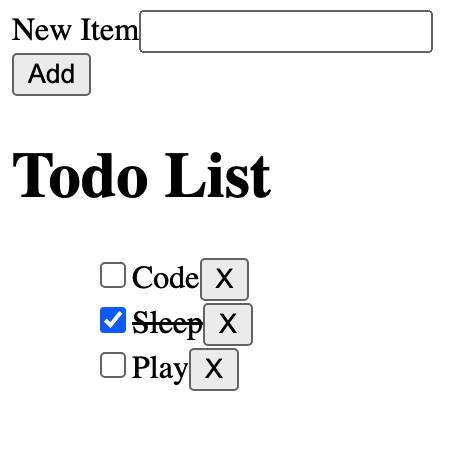

# Todo List TDD
A todo list app built with React using TDD with tests written in Vitest, React Testing Library, and Cypress. This demo app was build during the live coding workshop series "Build it from Scratch" I delivered while working as a mentor and trainer @ Scrimba.

## In This Document:
- [Live Application URL](#live-application-url)
- [How to Use the Application](#how-to-use-the-application)
- [Technologies Used](#technologies-used)
- [Future Features:](#future-features)
- [Challenges and Learning Points:](#challenges-and-learning-points)

## Live Application URL
[https://todo-tdd.netlify.app/](https://todo-tdd.netlify.app/)

## How to Use the Application
### Home Page
1. A user can add a new todo item to the list.
2. A user can check off an existing todo item.
3. A user can delete an existing todo item.

## Technologies Used
1. React.
2. Vitest, React Testing Library, and Cypress for testing.
   

## Future Features:
1. Add the tests to a deployment pipline. 

## Challenges and Learning Points:
1. It was a fun learning experience to incorporate the React Testing Library and Cypress.

[Up](README.md)
